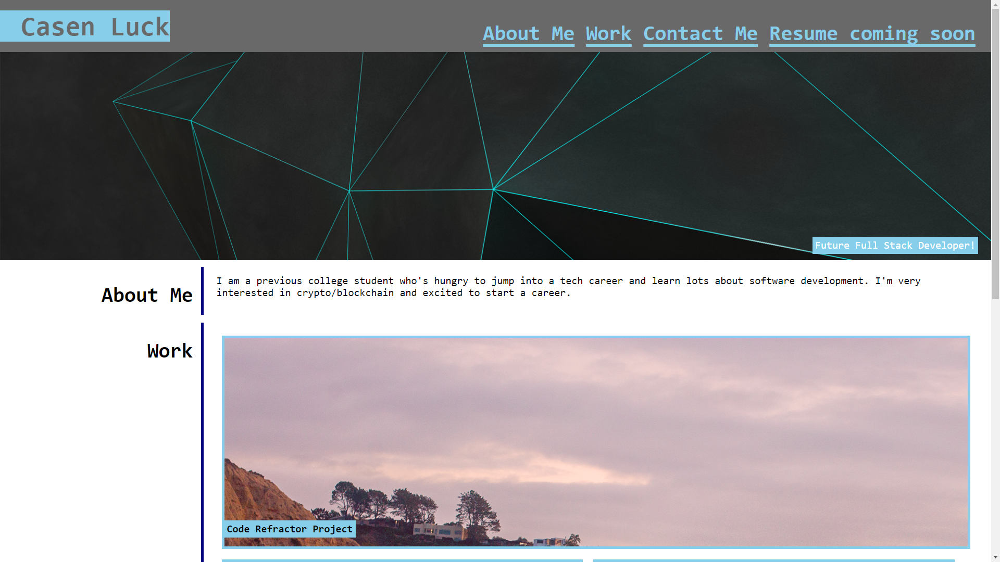
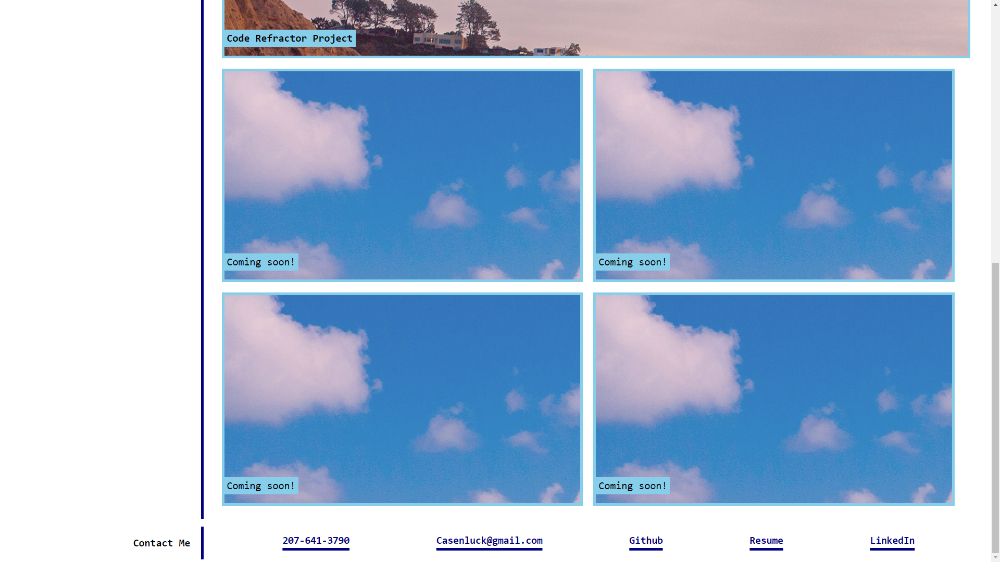

## Title

This projects title is Portfolio Website and it is a website I made from scratch using my new found HTML and CSS coding skills so that it follows accessibility standards.

## Languages

Used HTML and CSS to create this website.

## Objective

- Created a website with working navigation links.
- Integrate semantic HTML elements into the index.html.
- Include Alt attributes for the sourced images.
- Include a concise Title element.
- Made it flexible when the size of the window is shrinked so that all elements are visible
- Made working links in the contact section
- Made the first project link accessible

## What was learned

I learned a lot more about layering with HTML and how to properly use CSS flex boxes, pseudo elements, and media queries. I learned more about how to properly organize a website from scratch so it's UI is intuitive to the user. 

## Project pictures/websitelink 

Screenshots below!

Link to Portfolio website
[Portfolio Website](https://cluck135.github.io/Coding-Portfolio-website/)

