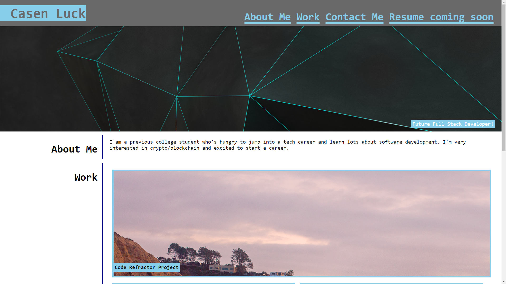
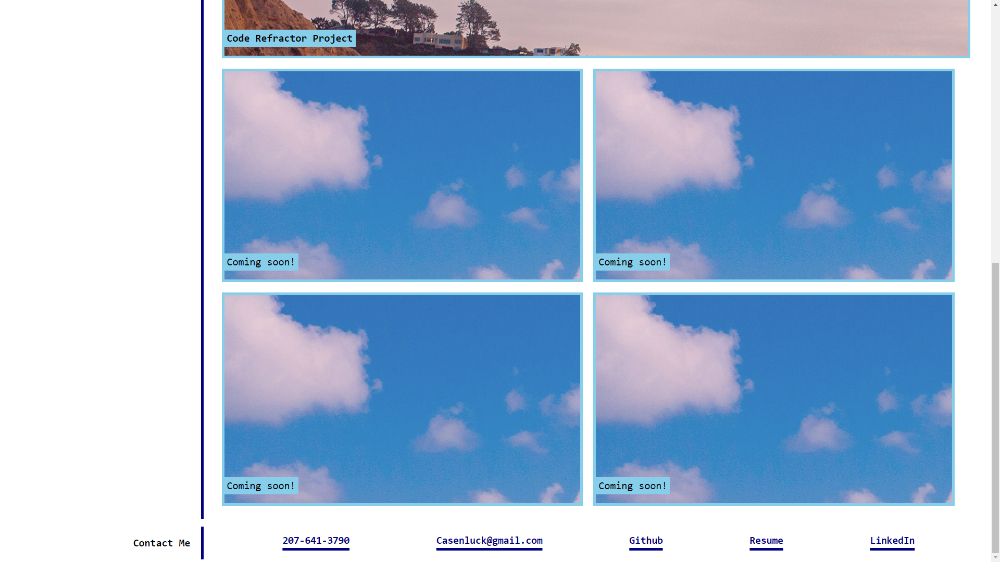

## Title

Portfolio Website is a website I made from scratch using my new found HTML and CSS coding skills, that displays my most recent work as a full stack dev/web dev

## Table of Contents
- [Usage Information](#usage-information)
- [Contribution Guidelines](#contribution-guidelines)
- [Test Instructions](#test-instructions)
- [Questions](#questions)
- [Project](#project)

## Usage Information
right click index.html and open in browser

## Contribution Guidelines
Open Source

## Test Instructions
N/A

## License
This project is licensed under the terms of the [MIT](https://opensource.org/licenses/MIT) license

## Questions
My Github Profile: [cluck135](https://github.com/cluck135)

Email me your questions at: [casenluck@gmail.com](mailto:casenluck@gmail.com)

## Project

Screenshots below!

Link to Portfolio website
[Portfolio Website](https://cluck135.github.io/Coding-Portfolio-website/)

